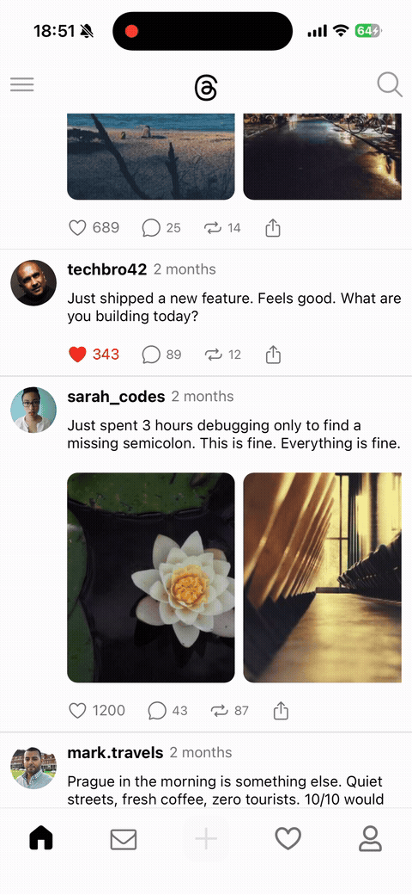
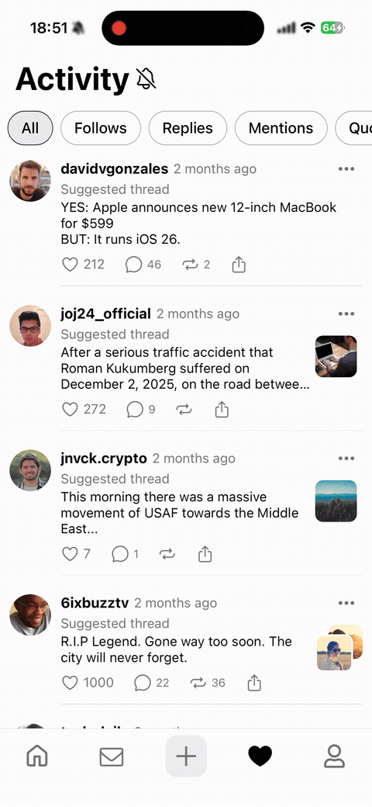

# Threads Clone

A pixel-faithful mobile clone of [Threads](https://www.threads.net/) — Meta's text-based social media app — built with React Native and Expo. The project replicates the core UI and interactions of Threads, including animated post feeds, scroll-driven headers, and like animations.


---

## Screenshots

<table>
  <tr>
    <td></td>
    <td></td>
    <td></td>
  </tr>
  <tr>
    <td align="center">Messages</td>
    <td align="center">Compose</td>
    <td align="center">Profile</td>
  </tr>
</table>

---

## Features

- **Feed screen** — scrollable list of posts with an animated Threads logo header that scales on scroll
- **Post cards** — display text content, image galleries, user avatar, username, and relative timestamps
- **Like interactions** — animated like counter with a slide-up number transition and color change
- **Activity screen** — notification feed with scroll-driven floating header and sticky filter tabs
- **Compose modal** — slides up from any tab, supports text input, topic tagging, and attachment options
- **Profile screen** — avatar, bio, follower count, and scrollable tab bar (Threads, Replies, Media, Reposts)
- **Messages screen** — placeholder screen with gradient background
- **Bottom tab navigation** — 5 tabs with icon-only design matching the Threads aesthetic

---

## Under the Hood

### Scroll-driven logo scaling

The Threads logo scales from 1.2× down to 0.8× as the user scrolls — with natural overscroll bounce — without touching the JS thread.

A `useSharedValue` captures `scrollY` inside `useAnimatedScrollHandler` (UI thread only). `useAnimatedStyle` + `interpolate` maps the scroll range to a scale value, clamped so it never exceeds the defined bounds.

```typescript
const scrollY = useSharedValue(0);

const scrollHandler = useAnimatedScrollHandler({
  onScroll: (event) => {
    scrollY.value = event.contentOffset.y;
  },
});

const logoStyle = useAnimatedStyle(() => {
  const scale = interpolate(scrollY.value, [-10, 40], [1.2, 0.8], Extrapolation.CLAMP);
  return { transform: [{ scale }] };
});
```


### Choreographed sticky header

On the Activity screen, three independent layers animate in sync as the user scrolls: the header slides up, the title fades out, and the filter tabs snap up to the safe area edge. React state updates only when the collapse threshold is crossed — not on every scroll frame.

Each layer gets its own `useAnimatedStyle` with a different `interpolate` range over the same shared `scrollY`. `useAnimatedReaction` + `runOnJS` bridges the animation thread to React state only on threshold change, keeping re-renders minimal.

```typescript
const headerStyle = useAnimatedStyle(() => ({
  transform: [{
    translateY: interpolate(scrollY.value, [0, TITLE_HEIGHT], [0, -TITLE_HEIGHT / 3], 'clamp'),
  }],
}));

const titleStyle = useAnimatedStyle(() => ({
  opacity: interpolate(scrollY.value, [0, TITLE_HEIGHT], [1, 0], 'clamp'),
}));

const filterTabsStyle = useAnimatedStyle(() => ({
  transform: [{
    translateY: interpolate(scrollY.value, [0, TITLE_HEIGHT], [HEADER_FULL_HEIGHT, insets.top], 'clamp'),
  }],
}));

useAnimatedReaction(
  () => scrollY.value >= TITLE_HEIGHT,
  (isCollapsed, previous) => {
    if (isCollapsed !== previous) runOnJS(setIsHeaderCollapsed)(isCollapsed);
  }
);
```



---

## Tech Stack

| Category | Technology |
|---|---|
| Framework | React Native 0.81 + Expo 54 |
| Language | TypeScript 5.9 |
| Navigation | React Navigation v7 (Stack + Bottom Tabs) |
| Animations | React Native Reanimated 4 |
| Icons | Expo Vector Icons (Ionicons, Octicons) |
| Gradients | Expo Linear Gradient |
| Date utilities | date-fns |

---

## Getting Started

**Prerequisites:** Node.js, Expo CLI, and either the Expo Go app or an iOS/Android simulator.

```bash
# Install dependencies
npm install

# Start the development server
npx expo start
```

Scan the QR code with Expo Go, or press `i` for iOS simulator / `a` for Android emulator.

---

## Project Structure

```
app/
├── src/
│   ├── screens/       # Full-screen components (Feed, Profile, Activity, etc.)
│   ├── components/    # Reusable UI components (PostCard, ActivityPost, etc.)
│   ├── navigation/    # Tab and stack navigator configuration
│   ├── data/          # Mock data (posts, users, activity)
│   └── types/         # Shared TypeScript types
├── assets/            # App icons and splash screen images
└── App.tsx            # Entry point
```

---

## License

This project is licensed under the [MIT License](LICENSE).
